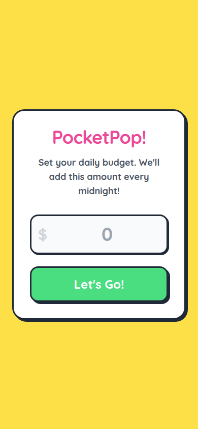
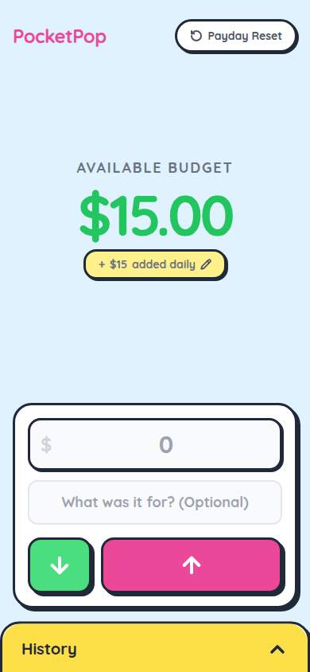
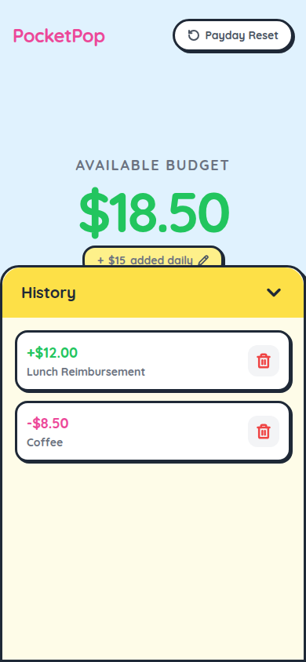

# 🪙 PocketPop!

PocketPop is a playful, mobile-first, neubrutalist PWA (Progressive Web App) budget tracker designed to keep your spending in check with style. It features a bold toy aesthetic, solid borders, flat drop shadows, and vibrant colors.

## 📱 Screenshots

Here is a look at PocketPop in action:

| 1. Onboarding / Setup | 2. Main Dashboard | 3. History Log |
|:---:|:---:|:---:|
|  |  |  |

---

## ✨ Features

* **Neubrutalist Toy Aesthetic:** Inspired by tactile interfaces and retro game aesthetics. Built using Tailind CSS utility borders (`toy-border`, `toy-shadow`), the Quicksand font, and Lucide icons.
* **Daily Budgeting Roll-overs:** Set your daily target (e.g., $15.00). Each midnight that passes, the system calculates elapsed days and increments your available balance.
* **Instant Record & Categorization:** Add income (Get 🟢) or expenses (Spend 💗) with simple descriptions in just two taps.
* **Interactive History Drawer:** Swipes up to reveal full transaction log history. You can easily delete incorrect transactions to adjust your balance.
* **PWA & Offline Ready:** Configured with a Service Worker caching setup so that the app loads instantly, even when completely offline.
* **Self-updating UI:** Listens for updates in the background. If a new version is pushed, a toast alert prompts you to reload and get the latest changes immediately.

---

## 🛠️ Technology Stack

* **HTML5 & Semantic Structure**
* **TailwindCSS** (via CDN for neat utility styles)
* **Vanilla JavaScript** (state and local storage synchronization)
* **Service Worker API** (caching and offline support)
* **Lucide Icons**

---

## 🚀 Getting Started

Since PocketPop is fully static, there is no build step required. You can run it locally in seconds:

1. Clone the repository:
   ```bash
   git clone https://github.com/dillontkh/pocketpop.git
   cd pocketpop
   ```

2. Run a simple local web server:
   ```bash
   # Using Python
   python3 -m http.server 8000

   # Or using Node.js
   npx serve .
   ```

3. Open `http://localhost:8000` (or the port specified by serve) in your browser.

---

## 📂 Project Structure

* **`index.html`** - The single-page entry point, styling customization, UI layout, and dashboard behavior.
* **`sw.js`** - Service worker handling the offline caching strategies (Stale-While-Revalidate for local assets, Cache-First for CDNs).
* **`manifest.json`** - PWA manifest enabling installations as a standalone mobile application.
* **`icon.svg`** - Vector icon asset for high-density app shortcuts and browser tabs.
* **`screenshots/`** - Live application screenshots featured in this documentation.
